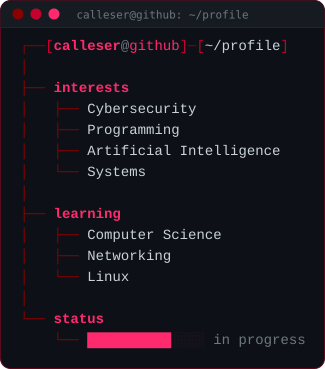
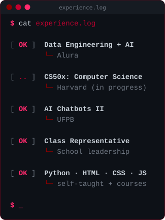
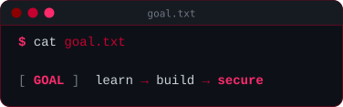

  

---

 whoami" />

I'm a high school student who got into technology by building things,
and got curious about what happens underneath, including how systems fail.

I like to think about security a bit like chess:
a lot of it is about planning ahead and noticing weak spots early.

 

---

 experience" />

 

---

 stack" />

  

  
  

---

 current_objective" />

I want to understand technology not only from the side of building systems,
but also from the side of analyzing and protecting them.

---

 next_move" />

